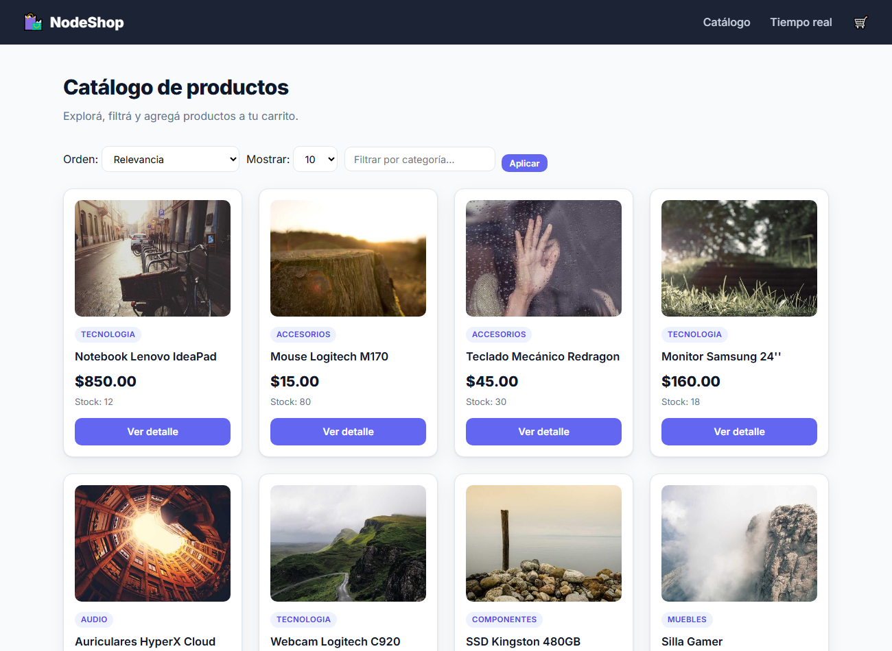
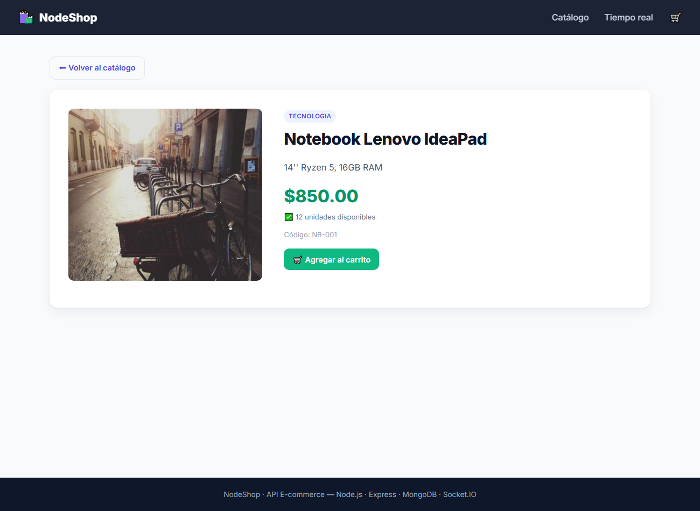
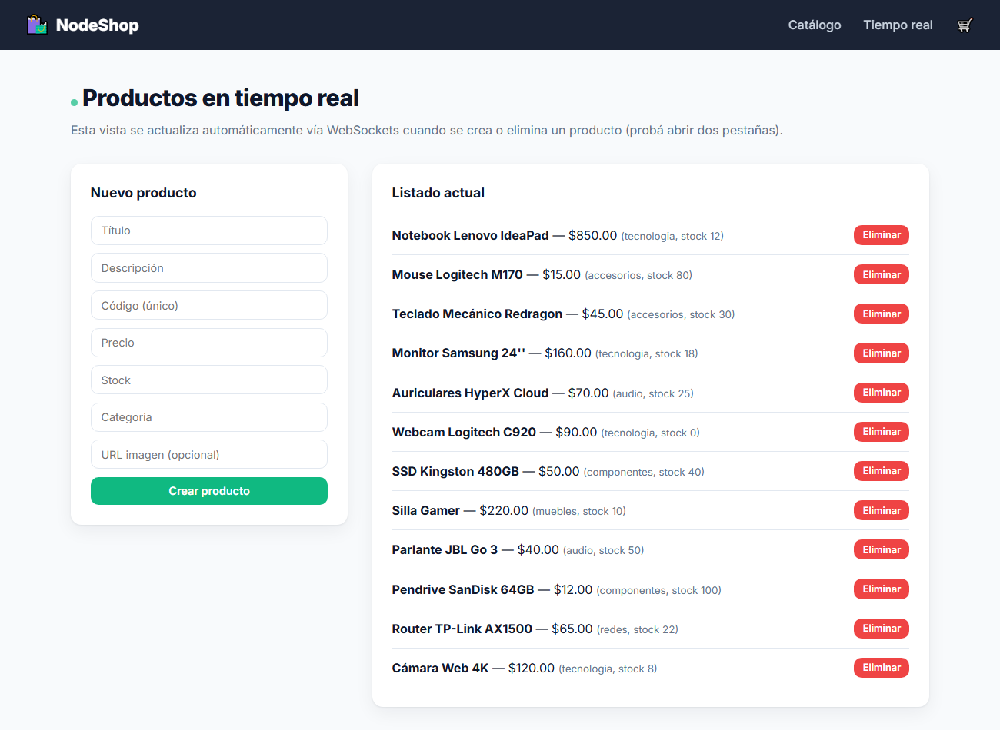

# 🛍️ NodeShop — E-commerce Backend API

API de e-commerce que gestiona **productos**, **carritos de compra** y el
**proceso de compra con generación de tickets**. Persistencia en **MongoDB
(Mongoose)** y **FileSystem**, vistas con **Handlebars** y actualización en
**tiempo real con WebSockets (Socket.IO)**.

Proyecto final de Backend.



---

## 🚀 Tecnologías

- **Node.js** + **Express 5** (servidor y Express Router)
- **MongoDB** + **Mongoose** (persistencia principal)
- **mongoose-paginate-v2** (paginación)
- **FileSystem** (persistencia alternativa, no eliminada)
- **Express-Handlebars** (motor de vistas)
- **Socket.IO** (WebSockets / tiempo real)
- **morgan** (logger de requests)
- **dotenv**, **cors**

---

## 🏛️ Arquitectura en capas

```
Cliente → Router → Controller → Service → DAO (Mongo | FS) → Base de datos
                                   │
                                   └── lógica de negocio (validaciones, compra)
```

- **Routers** (Express Router): definen las rutas.
- **Controllers**: reciben la request, llaman al service y arman la respuesta.
- **Services**: contienen la **lógica de negocio** (incluido el proceso de compra).
- **DAO (Data Access Object)**: abstraen el acceso a datos (Mongo o FileSystem).
- **Factory**: según `PERSISTENCE` (.env) decide qué DAO instanciar.
- **Models**: esquemas de Mongoose (`products`, `carts`, `tickets`).
- **Middlewares**: validación y manejo centralizado de errores.

Este desacople permite **cambiar el motor de persistencia sin tocar la lógica**.

### Estructura del proyecto

```
ecommerce-backend/
├── src/
│   ├── app.js                      # Servidor principal (puerto 8080)
│   ├── config/                     # config + conexión a MongoDB
│   ├── controllers/                # products / carts
│   ├── services/                   # ← lógica de negocio (products, carts, compra)
│   ├── dao/
│   │   ├── factory.js              # Selecciona Mongo o FS
│   │   ├── models/                 # product / cart / ticket (Mongoose)
│   │   ├── mongo/                  # DAO MongoDB
│   │   └── fs/                     # DAO FileSystem
│   ├── data/                       # Persistencia FS (JSON)
│   ├── middlewares/                # errores + validación
│   ├── routes/                     # products / carts / views
│   ├── sockets/                    # Socket.IO
│   ├── public/                     # CSS y JS de cliente
│   ├── utils/                      # helpers, seed, errores
│   └── views/                      # Plantillas Handlebars
└── package.json
```

---

## ⚙️ Instalación y ejecución

```bash
npm install
# Configurar .env (ver .env.example): PORT, MONGO_URL, PERSISTENCE
npm run seed     # (opcional) carga 12 productos de ejemplo
npm start        # o: npm run dev (nodemon)
```

Servidor en **http://localhost:8080**

| Recurso          | URL                                    |
| ---------------- | -------------------------------------- |
| API Productos    | http://localhost:8080/api/products     |
| API Carritos     | http://localhost:8080/api/carts        |
| Health check     | http://localhost:8080/api/health       |
| Catálogo         | http://localhost:8080/products         |
| Detalle          | http://localhost:8080/products/:pid    |
| Carrito          | http://localhost:8080/carts/:cid       |
| Tiempo real      | http://localhost:8080/realtimeproducts |

---

## 📦 Endpoints — Productos `/api/products`

| Método | Ruta      | Descripción                                |
| ------ | --------- | ------------------------------------------ |
| GET    | `/`       | Lista con `limit`, `page`, `query`, `sort` |
| GET    | `/:pid`   | Obtiene un producto por ID                 |
| POST   | `/`       | Crea un producto (ID autogenerado)         |
| PUT    | `/:pid`   | Actualiza un producto (no modifica el ID)  |
| DELETE | `/:pid`   | Elimina un producto                        |

`query`: `category:tecnologia`, `status:true`/`status:false`, o texto = categoría.
`sort`: `asc` | `desc` (por precio). Defaults: `limit=10`, `page=1`.

**Formato de respuesta del GET:**
```json
{
  "status": "success", "payload": [],
  "totalPages": 0, "prevPage": null, "nextPage": null, "page": 1,
  "hasPrevPage": false, "hasNextPage": false, "prevLink": null, "nextLink": null
}
```

---

## 🛒 Endpoints — Carritos `/api/carts`

| Método | Ruta                      | Descripción                                  |
| ------ | ------------------------- | -------------------------------------------- |
| POST   | `/`                       | Crea un carrito                              |
| GET    | `/:cid`                   | Lista productos del carrito (con `populate`) |
| POST   | `/:cid/products/:pid`     | Agrega producto (si existe, suma cantidad)   |
| DELETE | `/:cid/products/:pid`     | Elimina un producto del carrito              |
| PUT    | `/:cid`                   | Reemplaza todos los productos                |
| PUT    | `/:cid/products/:pid`     | Actualiza solo la cantidad                   |
| DELETE | `/:cid`                   | Vacía el carrito                             |
| POST   | `/:cid/purchase`          | **Finaliza la compra y genera un ticket**    |

### Proceso de compra (`POST /:cid/purchase`)
1. Verifica el **stock** de cada producto del carrito.
2. Compra los que tienen stock suficiente y **descuenta el stock**.
3. Genera un **ticket** (código único, fecha, monto total, comprador, detalle).
4. Deja en el carrito los productos que **no** se pudieron comprar.

```json
{
  "status": "success",
  "message": "Compra realizada con éxito",
  "payload": {
    "ticket": { "code": "TCK-47EC2F5B", "amount": 140, "purchaser": "...", "products": [...] },
    "purchased": [...],
    "failedProducts": []
  }
}
```

---

## 🗄️ Persistencia

- **MongoDB** (por defecto): base `ecommerce`, colecciones `products`, `carts`,
  `tickets`. El carrito guarda referencias y usa `populate`.
- **FileSystem** (`PERSISTENCE=fs`): `src/data/*.json`.

---

## ⚡ Tiempo real (WebSockets)

La vista `/realtimeproducts` permite crear y eliminar productos; la lista se
actualiza automáticamente en todos los clientes conectados mediante el evento
`products:updated`.

---

## 🖼️ Capturas

| Detalle de producto | Tiempo real |
| --- | --- |
|  |  |

---

## ✅ Requisitos técnicos cubiertos

- [x] Servidor Node.js + Express en el puerto 8080
- [x] Express Router (`/api/products`, `/api/carts`, vistas)
- [x] Middlewares (validación y manejo de errores)
- [x] Asincronía con `async/await`
- [x] Mongoose con modelos y relaciones (`populate`)
- [x] CRUD completo de productos y carritos
- [x] Paginación, filtros y ordenamiento
- [x] WebSockets para tiempo real
- [x] Persistencia dual MongoDB + FileSystem (DAO + Factory)
- [x] **Arquitectura en capas con Services**
- [x] **Proceso de compra con generación de tickets**
- [x] Código modular y organizado
